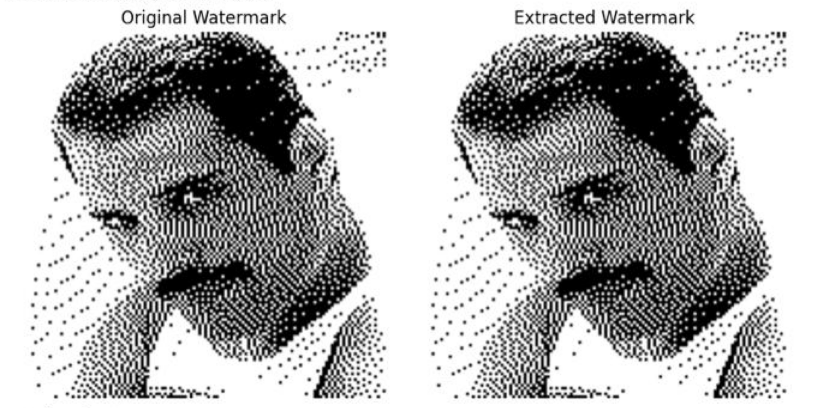

# Audio Watermarking via Matrix Decomposition


Проект реализует методы встраивания цифровых водяных знаков (Digital Watermarking) в аудиофайлы с использованием различных матричных разложений. Библиотека позволяет скрыто внедрять информацию (битовые последовательности) в аудиосигнал, обеспечивая баланс между незаметностью и устойчивостью к атакам.

---

## Демонстрация

### Водяной знак



### Аудио

| Описание | Файл |
|-------------------------|------|
| Оригинальное аудио | [🎵 freddie.wav](demo/freddie.wav) |
| Аудио с водяным знаком | [🎵 watermarked_freddie.wav](demo/watermarked_freddie.wav) |

---

## Особенности

* **5 Методов разложения:** Реализация алгоритмов на основе **SVD**, **QR**, **LU**, **Schur**, а также нового метода на основе **разложения Холецкого**.
* **Продвинутая обработка:** Использование вейвлет-преобразования (LWT) и преобразования Уолша-Адамара (FWHT) для формирования матриц из аудио-фреймов.
* **Безопасность:** Хаотическое шифрование (Chaotic Encryption) внедряемой последовательности.
* **Устойчивость:** Протестировано против сжатия (AAC), шума, ресэмплинга, эхо и других искажений.
* **Новая атака:** Реализован специальный алгоритм атаки, нацеленный на удаление водяных знаков данного типа.

---

## Установка

Склонируйте репозиторий и установите необходимые зависимости:

```bash
git clone https://github.com/RedSp1ke/audio_watermarking.git
cd audio_watermarking
pip install -r requirements.txt

```

---

## Использование 

Пример использования метода на основе SVD для внедрения и извлечения водяного знака:

```python
import numpy as np
from watermarking import SVDMethod, CholeskyMethod
from utils import load_audio, save_audio, bit_error_rate

# 1. Загрузка данных
audio_signal, fs = load_audio('data/original.wav')
watermark_bits = np.random.randint(0, 2, 128)  # Генерируем случайный ключ/знак

# 2. Инициализация (SVD или новый метод Cholesky)
# Параметры: quantization_step (Q) и scaling (beta)
algo = SVDMethod(quantization=0.5, block_size=256)

# 3. Внедрение (Embedding)
watermarked_audio = algo.embed(audio_signal, watermark_bits)
save_audio('data/stego_audio.wav', watermarked_audio, fs)

# 4. Атака (опционально, например, добавление шума)
# attacked_audio = add_noise(watermarked_audio, snr=20)

# 5. Извлечение (Extraction)
extracted_bits = algo.extract(watermarked_audio)

# 6. Оценка качества
ber = bit_error_rate(watermark_bits, extracted_bits)
print(f"Bit Error Rate: {ber:.4f}")

```

---

## Математическое обоснование

### Общий пайплайн

1. **Фрейминг:** Аудиосигнал $x[n]$ разбивается на блоки размера $N$
2. **Трансформация:** Применяется LWT и FWHT для формирования квадратной матрицы $A \in \mathbb{R}^{m \times m}$
3. **Разложение:** Матрица $A$ раскладывается одним из методов
4. **Внедрение:** Бит $b \in \{0, 1\}$ внедряется через квантование наибольшего коэффициента

### Сравнение разложений

| Метод | Формула разложения | Целевой коэффициент | Примечание |
|-------|-------------------|---------------------|------------|
| **SVD** | $A = U \Sigma V^T$ | $\sigma_1$ (наибольшее сингулярное число) | Самый устойчивый |
| **QR** | $A = QR$ | $\max(R_{ii})$ | Ортогональное разложение |
| **Schur** | $A = UTU^H$ | $\max(T_{ii})$ | Верхнетреугольная форма |
| **Cholesky** | $A = LL^T$ | $\max(L_{ii})$ | Требует $A \succ 0$ |
| **LU** | $A = LU$ | $\max(U_{ii})$ | Без ограничений |

### Формула квантования

Внедрение бита $b$ осуществляется модификацией коэффициента $C_{max}$:

$$Y = \left\lfloor \frac{C_{max}}{\Delta} \right\rfloor$$

где $\Delta$ — шаг квантования. Если чётность $Y \mod 2$ не совпадает с битом $b$, значение корректируется:

$$C'_{max} = \begin{cases} (Y+1) \cdot \Delta & \text{если } Y \mod 2 \neq b \\ Y \cdot \Delta & \text{иначе} \end{cases}$$

### Метрики качества

| Метрика | Формула | Описание |
|---------|---------|----------|
| **SNR** | $10 \log_{10} \frac{\sum x^2}{\sum (x-\hat{x})^2}$ | Отношение сигнал/шум (дБ) |
| **BER** | $\frac{\sum (b_i \neq \hat{b}_i)}{N} \cdot 100\%$ | Коэффициент битовых ошибок |
| **NC** | $\frac{\sum b_i \hat{b}_i}{\sqrt{\sum b_i^2 \sum \hat{b}_i^2}}$ | Нормализованная корреляция |


---

## Результаты и Атаки

В рамках проекта была исследована устойчивость к ряду атак:

1. **Традиционные атаки:**
* Добавление шума, Ресэмплинг, Dropout.
* Сжатие AAC (128 kbps).
* Эхо и изменение амплитуды.


2. **Специальная атака ("Затирание"):**
* Разработана атака, использующая обратное SVD и усреднение старших сингулярных чисел. Она эффективно удаляет водяной знак при сохранении приемлемого качества звука .

Ключевые выводы :

* **SVD** показал наилучшую устойчивость (низкий BER) среди всех методов.
* Новый метод **Cholesky** показал результаты на уровне QR и SD, превзойдя LU по качеству восстановления сигнала.

---

## Авторы

Проект выполнен командой (NLA Project) :
* **Давыдов Кирилл**
* **Радушев Даниил**
* **Бузанов Никита**
* **Галымжан Жанторе**
* **Церенг Сергей**

---

## Ссылки

1. Pranab Kumar Dhar, Tetsuya Shimamura, *Advances in Audio Watermarking Based on Matrix Decomposition*.